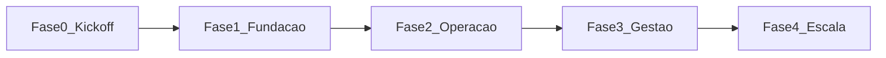

# Planejamento completo do roadmap (Fases 0 a 4)

**Referência:** [documento_enterprise.md](../documento_enterprise.md), [regras-negocio.md](../normativos/regras-negocio.md), [decisoes-e-pendencias.md](../projeto/decisoes-e-pendencias.md)  
**Última atualização do planejamento:** 2026-04-18  

Este arquivo é o **índice mestre**: resume objetivos, ordem e vínculo com o MVP. Cada fase tem documento próprio com detalhamento (entregáveis, critérios de aceite, riscos). **Volte aqui** ao ajustar escopo ou datas; depois sincronize o arquivo da fase afetada e o [backlog.md](../projeto/backlog.md).

**Decisões de produto** que afetam escopo (status de pedido, sessão, URL, categorias, etc.): [decisoes-e-pendencias.md](../projeto/decisoes-e-pendencias.md) **DEC-14 … DEC-20** e tabela **Gates antes do desenvolvimento**.

## Visão em uma página

| Fase | Nome | Foco principal | Documento |
|------|------|----------------|-----------|
| 0 | Kickoff | Docs, convenções, contrato de qualidade (testes/relatórios HTML), decisão monorepo | [fase-00-kickoff.md](fase-00-kickoff.md) |
| 1 | Fundação | Docker, Makefile, DB (**Postgres pin** §20), tenant + JWT, `stores`/`users`, **OpenAPI 3** (RNF-DevEx-08), esqueleto Next mobile-first, ajuda contextual mínima | [fase-01-fundacao.md](fase-01-fundacao.md) |
| 2 | Operação | Produtos, estoque (itens + lotes), pedidos (status, reserva, idempotência conforme priorização), APIs mínimas §17 | [fase-02-operacao.md](fase-02-operacao.md) |
| 3 | Gestão | Receitas, produção (**idempotência** RNF-Arq-02b), precificação, `/reports/financial` básico | [fase-03-gestao.md](fase-03-gestao.md) |
| 4 | Escala | Observabilidade, CI/CD §24, hardening, priorização do backlog enterprise (§23) | [fase-04-escala.md](fase-04-escala.md) |

## MVP (§22) vs fases

| Requisito MVP | Onde entra (planejado) |
|---------------|-------------------------|
| Autenticação | Fase 1 (JWT + usuário por loja) |
| Catálogo | Fase 2 (`products`) |
| Pedidos | Fase 2 (`orders`, `order_items`; fluxo §19; concorrência §12) |
| Estoque básico | Fase 2 (`inventory_items`, `inventory_batches`, `stock_movements` mínimo) |
| Receitas | Fase 3 (`recipes`, `recipe_items`, produção) |
| Precificação simples | Fase 3 (custo → margem → preço) |

Itens do **§23 backlog enterprise** ficam fora do MVP salvo quando explicitamente puxados para uma fase (ex.: multi-usuário reforçado na Fase 4).

## Equivalência com o planejamento em texto (`inicio_planejamento.txt`)

O arquivo [inicio_planejamento.txt](../../inicio_planejamento.txt) usa outros nomes de marco (MVP 1/2/3, etapas 1–5 de especificação, fases A–E arquiteturais). Esta tabela **não substitui** as Fases 0–4 abaixo; apenas ajuda a ler o material bruto sem conflito.

| Texto (inicio_planejamento) | Fases deste repositório | Notas |
|-----------------------------|-------------------------|--------|
| **MVP 1** (auth, loja, catálogo, produtos, clientes, pedidos WhatsApp + manual, estoque produto final, dashboard básico) | Fase 1 + **parte** da Fase 2 | Insumos/receitas/precificação completa ficam para Fase 2–3 conforme tabela MVP §22 |
| **MVP 2** (insumos, receitas, produção, precificação) | Fase 2 (lotes/insumos) + Fase 3 (receitas/produção/preço) | Alinhar com [requisitos-funcionais.md](../normativos/requisitos-funcionais.md) |
| **MVP 3** (relatórios avançados, custos operacionais, impressão, pagamentos, integrações) | Fase 4 + [backlog.md](../projeto/backlog.md) enterprise | Priorização explícita |
| **Etapas 1–5** (descoberta → protótipos → implementação) | Metodologia transversal | Não mapeiam 1:1 para Fase 0–4 |
| **Fases A–E** (arquitetura txt) | A ≈ F0–F1; B ≈ F2 comercial; C ≈ F2–F3 operação; D ≈ F3 gestão; E ≈ F4 + backlog | Ver [decisoes-e-pendencias.md](../projeto/decisoes-e-pendencias.md) |

## Fluxo de dependência (ordem fixa)

## Testes e qualidade (todas as fases)

- **§21:** unitários (camada de serviço) + integração (fluxos); meta **90%** de cobertura — aplicar de forma **progressiva** (ex.: não travar Fase 1 com 90% global).
- Relatórios **HTML** para validação visual: ver [doc/README.md](../README.md).

## Ao alterar o plano

1. Editar o arquivo da fase e/ou este roadmap.  
2. Atualizar [backlog.md](../projeto/backlog.md) se surgir novo débito ou mudança de escopo.  
3. Registrar data em [execucao/CHANGELOG-FASES.md](../execucao/CHANGELOG-FASES.md).
