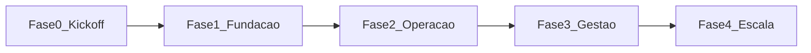

# Planejamento completo do roadmap (Fases 0 a 4)

**Referência:** [documento_enterprise.md](../documento_enterprise.md)  
**Última atualização do planejamento:** 2026-04-17  

Este arquivo é o **índice mestre**: resume objetivos, ordem e vínculo com o MVP. Cada fase tem documento próprio com detalhamento (entregáveis, critérios de aceite, riscos). **Volte aqui** ao ajustar escopo ou datas; depois sincronize o arquivo da fase afetada e o [backlog.md](../backlog.md).

## Visão em uma página

| Fase | Nome | Foco principal | Documento |
|------|------|----------------|-----------|
| 0 | Kickoff | Docs, convenções, contrato de qualidade (testes/relatórios HTML), decisão monorepo | [fase-00-kickoff.md](fase-00-kickoff.md) |
| 1 | Fundação | Docker, Makefile, DB, tenant + JWT, `stores`/`users`, esqueleto Next mobile-first, padrão de ajuda contextual mínimo | [fase-01-fundacao.md](fase-01-fundacao.md) |
| 2 | Operação | Produtos, estoque (itens + lotes), pedidos (status, reserva, idempotência conforme priorização), APIs mínimas §17 | [fase-02-operacao.md](fase-02-operacao.md) |
| 3 | Gestão | Receitas, movimentações, precificação, `/reports/financial` básico | [fase-03-gestao.md](fase-03-gestao.md) |
| 4 | Escala | Observabilidade, CI/CD §24, hardening, priorização do backlog enterprise (§23) | [fase-04-escala.md](fase-04-escala.md) |

## MVP (§22) vs fases

| Requisito MVP | Onde entra (planejado) |
|---------------|-------------------------|
| Autenticação | Fase 1 (JWT + usuário por loja) |
| Catálogo | Fase 2 (`products`) |
| Pedidos | Fase 2 (`orders`, `order_items`; fluxo §19; concorrência §12) |
| Estoque básico | Fase 2 (`inventory_items`, `inventory_batches`, `stock_movements` mínimo) |
| Receitas | Fase 3 (`recipes`, `recipe_items`, produção) |
| Precificação simples | Fase 3 (custo → margem → preço) |

Itens do **§23 backlog enterprise** ficam fora do MVP salvo quando explicitamente puxados para uma fase (ex.: multi-usuário reforçado na Fase 4).

## Fluxo de dependência (ordem fixa)

## Testes e qualidade (todas as fases)

- **§21:** unitários (camada de serviço) + integração (fluxos); meta **90%** de cobertura — aplicar de forma **progressiva** (ex.: não travar Fase 1 com 90% global).
- Relatórios **HTML** para validação visual: ver [doc/README.md](../README.md).

## Ao alterar o plano

1. Editar o arquivo da fase e/ou este roadmap.  
2. Atualizar [backlog.md](../backlog.md) se surgir novo débito ou mudança de escopo.  
3. Registrar data em [execucao/CHANGELOG-FASES.md](../execucao/CHANGELOG-FASES.md).
